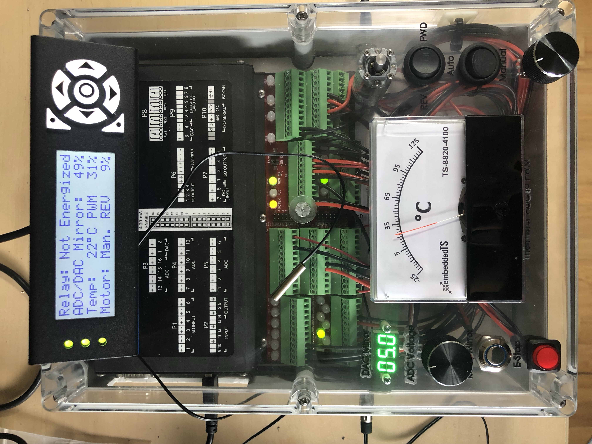

# TS-8820-4100 Demo

This project aims to showcase the many features of the [TS-8820-4100](https://www.embeddedts.com/products/TS-8820-4100) platform.

The [TS-4100](https://www.embeddedts.com/products/TS-4100) is our i.MX6UL System-on-Module (SoM) compatible with multiple baseboards using a high-density connector.

The TS-8820 is a baseboard targetted at industrial applications and includes multiple ADC channels, multiple DAC channels, Relays, dual H-bridge driver, opto-isolated high-voltage I/O, as well as opto-isolated RS-485, RS-232, and CAN. The I/O includes features such as pulse counting on the inputs and PWM controlled outputs. The ADCs can be configured for -5 V to +5 V, -10 V to +10 V, 4 mA to 20 mA input, and supporting up to 8 thermistors. The DAC outputs have a range of 0 V up to 12.5 V (depending on input voltage).

## About the Demo

This demo attempts to showcase as many features of the platform's industrial I/O as possible. The embedded ZPU (a 32-bit microcontroller with gcc toolchain) in-FPGA of the TS-4100 was programmed to handle the brunt of the work. This microcontroller application interfaces directly with the TS-8820 I/O as well as providing status updates to Linux in real-time.

The attachable USB character LCD is able to provide stats on every part of the demo, is hot-pluggable with the application, and also displays information about the project at the press of any of its face buttons.

Features of the demo include:
- ADC to DAC mirror. The ZPU reads the TS-8820-4100 ADC input to read the position of a potentiometer and outputs this voltage on the DAC. The DAC output is connected to a panel mount voltmeter display. The LCD can display the rotational position of the potentiometer on a scale of 0-100%
- Relay mirror. This is a simple switch read by the ZPU and, when pressed, will turn on a relay. The relay is wired to an LED connected to the switch. The LCD can display the relay status as "Energized" or "Not Energized"
- Thermistor ADC to PWM. A thermistor is connected via a TRS jack to the system. The ZPU reads the TS-8820-4100 ADC and calculates the temperature based on its resistance. This in turn drives the large analog meter. This meter has its back scale modified for degrees C, and the needle position is controlled via PWM. The LCD can display both the temperature read by the thermistor in degrees C, as well as the PWM duty cycle output on a scale of 0-100%
- DC motor. This motor has two modes of operation, manual and automatic. In automatic mode, forward or reverse is selected by a second switch. The ZPU uses PWM to drive the H-bridge direction and speed. Additionally, the ZPU ensures the motor is ramped up and ramped down in speed and direction to ensure smooth transition and operation. In manual mode, the speed and direction of the motor are determined by a potentiometer knob connected to an ADC channel of the TS-8820-4100. The LCD can display mode, direction, duty cycle, and if the motor is in a ramp phase.
- E-Stop. This latching button is also monitored by the ZPU. When lactched on, every other output is set to a safe off state immediately and the LED in the E-Stop button is flashed to indicate a stopped state. The ADC/DAC mirror output drops to 0, the relay mirror no longer activates the relay, the temperature display goes to zero, and the motor is immediately put in brake mode. The LCD can display a very loud message indicating that the E-Stop has been triggered.
